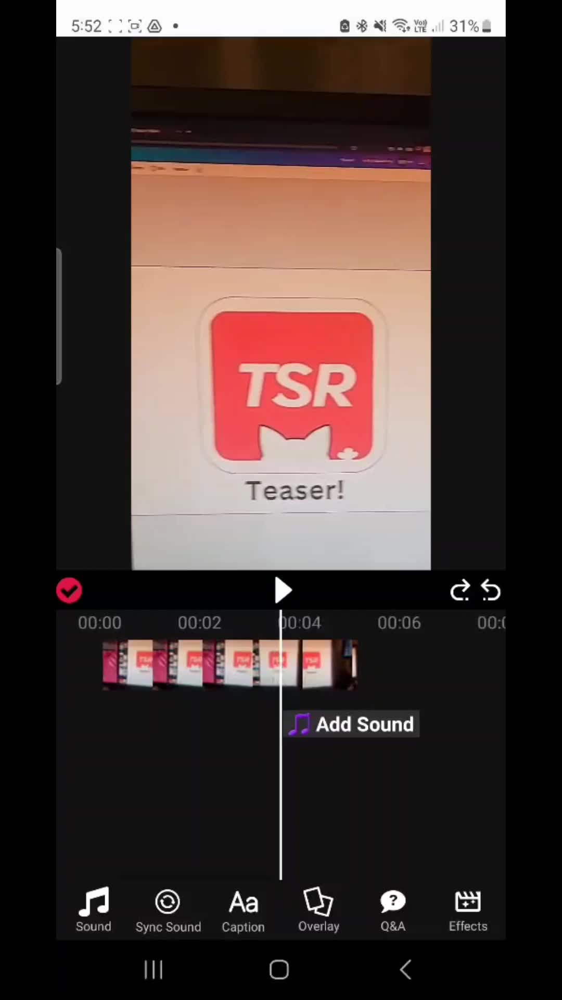

# Relationships between app functionalities and backend

| Image | Source Code   |
| ---   | ---   |
|  | Main feed mainly relates to `src/frontend/teaser/components/templates/TeaserViewList.js`in the frontend and `src/backend/teaser/core/services/post_service.py` in the backend.   |
|  | The video editing screen can be found at `src/frontend/teaser/screens/upload/UploadEditVideoScreen.js`. Video pre-processing such as concatenation and adding music will be done on the frontend.   |
