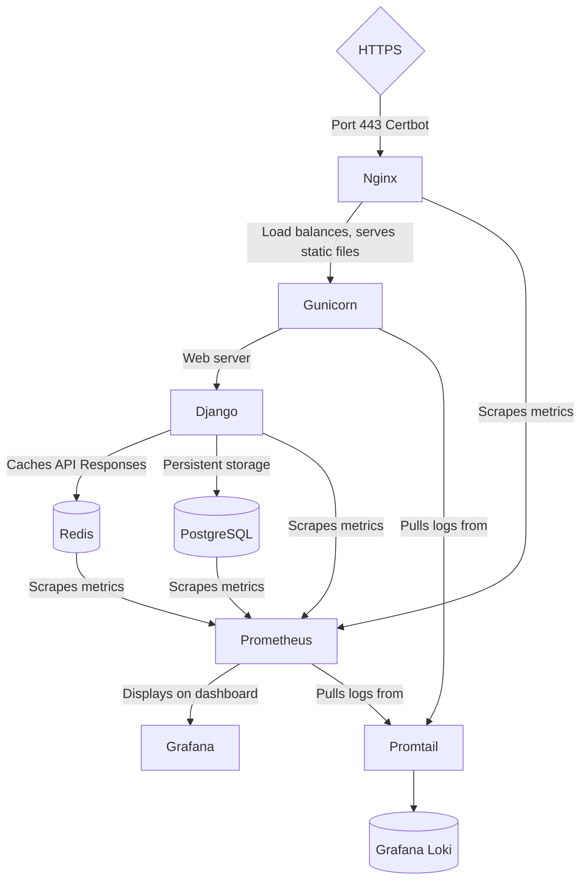

# Architecture Model

How Teaser is implemented:

```mermaid
flowchart TD
    HTTPS{HTTPS} -->|Port 443 Certbot| Nginx
    Nginx --> |Load balances, serves static files| Gunicorn[Gunicorn]
    Gunicorn -->|Web server| Django[Django]
    Django -->|Caches API Responses| Redis[(Redis)]
    Django -->|Persistent storage| PostgreSQL[(PostgreSQL)]
    Django -->|Scrapes metrics| Prometheus
    Redis -->|Scrapes metrics| Prometheus
    Nginx -->|Scrapes metrics| Prometheus
    PostgreSQL -->|Scrapes metrics| Prometheus
    Prometheus -->|Displays on dashboard| Grafana
    Gunicorn -->|Pulls logs from| Promtail
    Prometheus -->|Pulls logs from| Promtail
    Promtail --> Loki[(Grafana Loki)]
```
